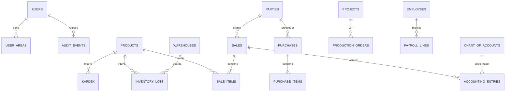

# Base de datos — Instalaciones Raquel (DBeaver / Beekeeper)

El Corte 3 pide **una sola base relacional centralizada**. El núcleo es PostgreSQL (opción **PostgreSQL** en *New Connection* de la captura). Lo no relacional queda **solo** en JSONB de auditoría, QR y snapshot fiscal.

## Cómo abrirla en DBeaver / Beekeeper (la captura)

1. Arrancá PostgreSQL (Docker recomendado, desde la raíz del repo):

```bash
docker compose up -d
```

2. En el cliente: **New Connection** → **PostgreSQL**.
3. Datos:

| Campo | Valor |
|---|---|
| Host | `localhost` |
| Port | `5432` |
| Database | `instalaciones_raquel` |
| Username | `raquel` |
| Password | `raquel2026` |

4. Probar conexión. Las tablas quedan en el esquema **`public`**.

Si PostgreSQL ya está instalado en Windows (sin Docker): creá la base `instalaciones_raquel` y ejecutá en orden `database/00_schema.sql` y `database/01_seed.sql` (SQL Editor → Execute).

## Relacional vs documento

| Qué | Por qué |
|---|---|
| Tablas + FK (productos, lotes, ventas, detalle, asientos, usuarios) | PEPS, IVA 15 %, partida doble, crédito, nómina |
| `inventory_lots` | Un lote = un costo; el egreso ordena por `entry_date` |
| `sale_items` / `purchase_items` | Composición UML (el detalle no vive sin el documento) |
| `accounting_entries` con `CHECK (debit = credit)` | RD partida doble |
| JSONB en `audit_events.before_data/after_data` | RF16 valor anterior / nuevo |
| `qr_payload` / `line_snapshot` | Comprobante inmutable, no se consulta como tabla maestra |

Las contraseñas de semilla coinciden con el prototipo: `raquel2026` (usuarios `admin@raquel.com`, `vendedor@raquel.com`, etc.).

El ERP web sigue usando `localStorage` en el navegador para el prototipo; esta base es el modelo formal (Corte 2/3) que se inspecciona en DBeaver y el que debe persistir el backend.

## Modelo entidad-relación (núcleo)


